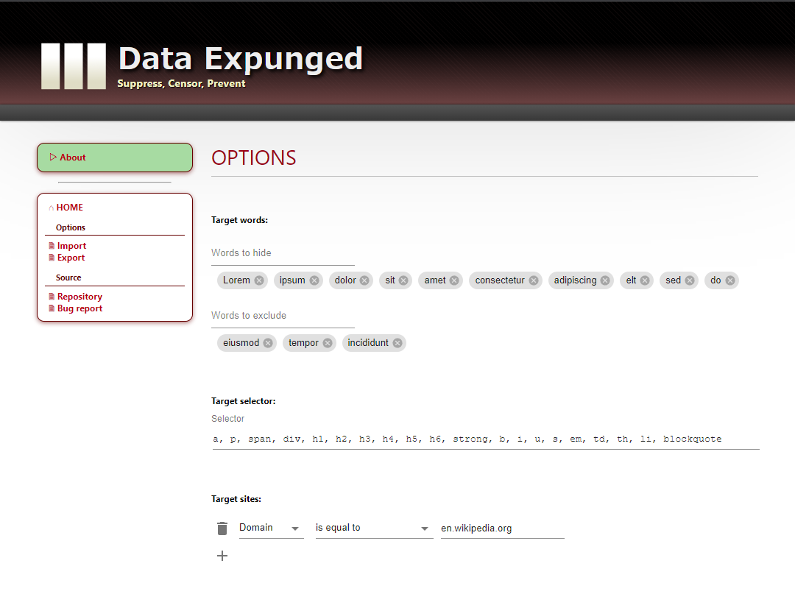

# [データ削除済み]
## 特別導入手順
[データ削除済み]は現在収容されていません。一般市民はChromeウェブストアを通じて誰でもインストールすることが可能です。

- [[データ削除済み] - Chrome ウェブストア](https://chrome.google.com/webstore/detail/data-expunged/lmoeanpjjaliocmmbjloeiccpkoccado)

研究目的で使用する場合は、以下の手順に従ってください。

1. このリポジトリをクローン
1. `pnpm install` & `pnpm build`.
1. `/extensions`フォルダをパッケージ化されていない拡張機能として読み込む

## 説明
[データ削除済み]は指定したテキストをSCP報告書のように隠すためのChrome拡張機能です。この拡張機能を使用すると、以下のようにユーザーの見たくない単語を覆い隠すことができます。

## オプション
この拡張機能を使用するには、いくつかのオプションを設定する必要があります。オプションはブラウザ右上の拡張機能アイコンからアクセスすることができます。

### 検閲する単語
隠したい単語の一覧です。ここに指定された単語が含まれるHTMLタグを、ページ上から隠します。
以下のHTMLタグは黒塗り(&#9608;&#9608;&#9608;)の代わりに`[データ削除済み]`に置き換えられます。

- `div`, `blockquote`, `p`, `td`, `li`

隠された部分をクリックすることで、元のテキストを表示することができます。

### 除外する単語
除外したい単語の一覧です。上記の"検閲する単語"が含まれているテキストであっても、ここで指定した単語が含まれている場合は対象から除外します。

### CSSセレクター
ここで指定したセレクターの対象となるHTMLタグが拡張機能の対象になります。

### 対象のサイト
拡張機能の対象となるサイトの条件を指定します。条件には、ドメインまたはURLに対して、指定した文字列が一致または不一致するかどうかを指定することができます。デフォルトでは全てのサイトが対象です。

## その他の機能
- オプションのインポート・エクスポート
- 右クリックから選択中の単語を"検閲する単語"に追加する
- ブラウザ右上のアイコンから、現在表示しているページまたはサイトを対象外に設定する

## 作者
- 山田 拓実 (Twitter: @tackme31)

## ライセンス
MIT
