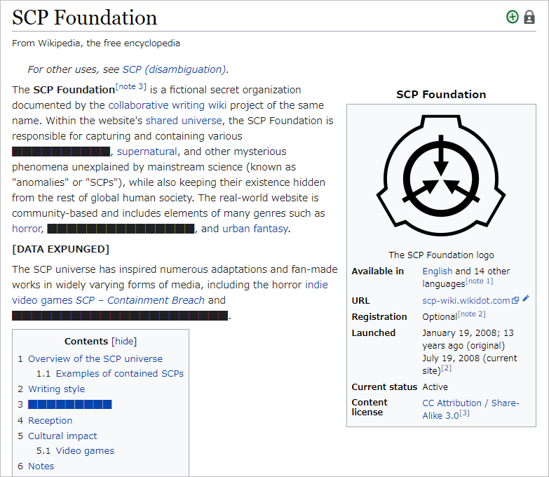
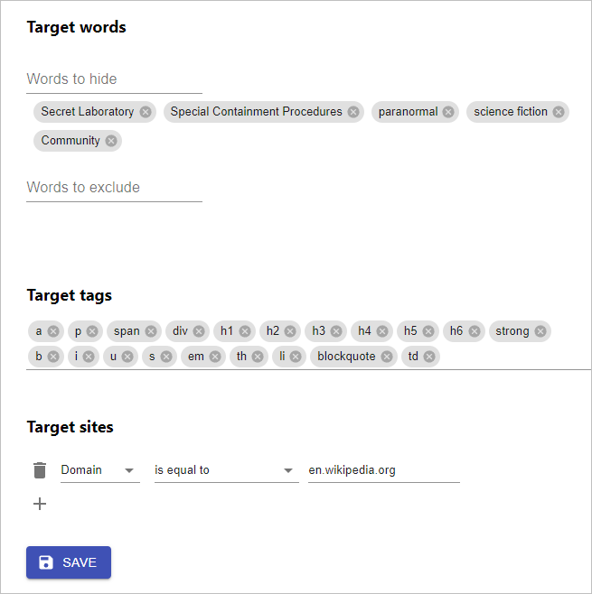

# [DATA EXPUNGED]
[DATA EXPUNGED] is a Google Chrome extension to hide text like SCP format.

Example:

## Options

## Installation
This extension is not yet available on Chrome Web Store. To installation, build this project and load as a unpacked extension.

1. Clone this repository
1. `npm install` & `npm run build`
1. Load `/build` folder as a unpacked extension.

## TODO
- [ ] Setting export.
- [ ] Add a current site/page to exclude list from popup.
- [ ] Add a selected text to hide word.

## Author
- Takumi Yamada (xirtardauq@gmail.com)

## License
MIT
