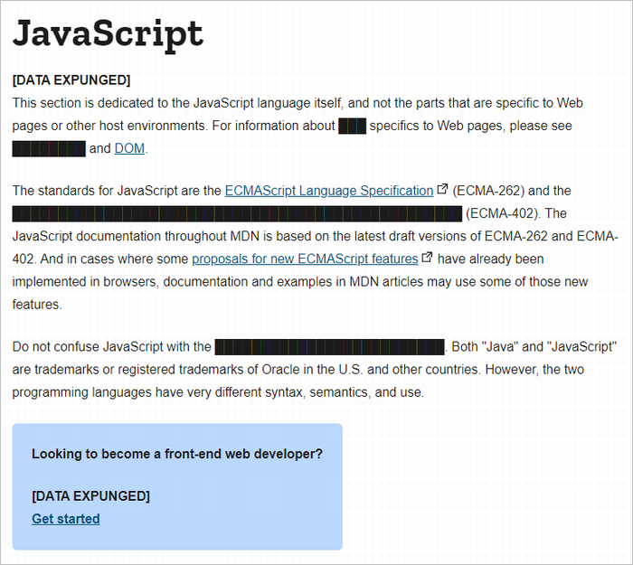
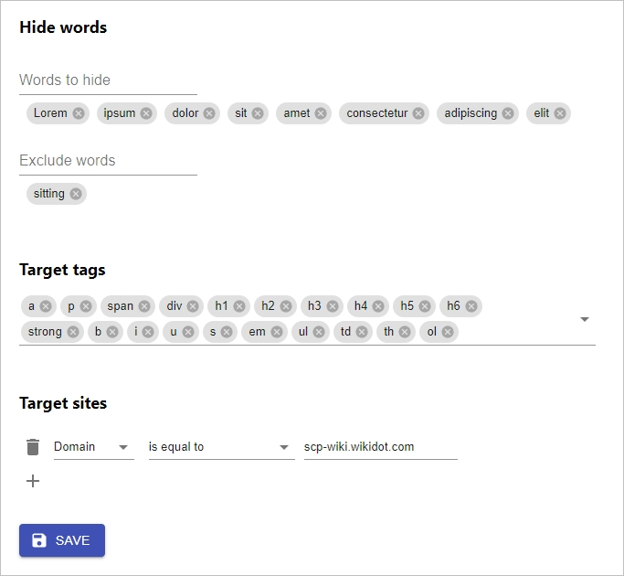

# [DATA EXPUNGED]
█████████████ is a Google Chrome extension to hide text like SCP format.

DEMO:

## Settings

## Installation
This extension is not yet available on Chrome Web Store. To installation, build this project and load as a unpacked extension.

1. Clone this repository
1. `npm install` & `npm run build`
1. Load `/build` folder as a unpacked extension.

## Author
- Takumi Yamada (xirtardauq@gmail.com)

## License
MIT
